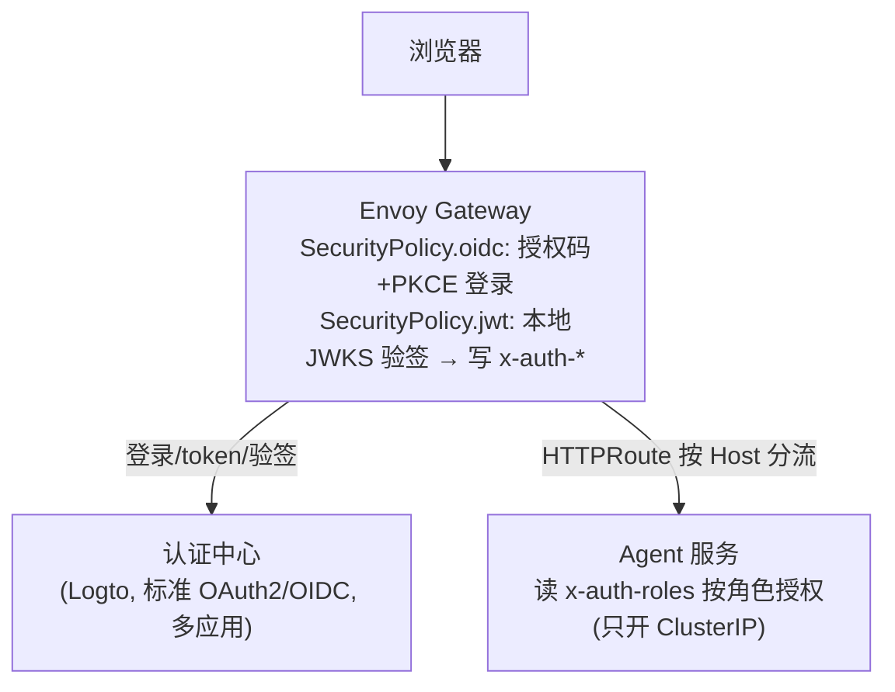

# auth-platform — 智能体集中认证鉴权平台

为多个 agent 服务提供**集中式认证鉴权**：以 **Envoy Gateway + SecurityPolicy** 作为统一入口，
对接**单一认证中心（Logto）**完成登录与 `id_token` 验签，并把「用户身份 + 角色」以 `x-auth-*`
请求头带给 Agent（**校验 `id_token`**：Logto 的 `access_token` 是 opaque、不含 `roles`）。
**所有去往 Agent 的请求都经 Envoy Gateway**。Agent 只需按 `x-auth-roles` 授权。

## 架构



- **认证中心**：单一标准 OAuth2/OIDC（Logto），统一身份 + 多个应用(client)。每个 Agent 一个
  Logto 应用，回调域名各自独立。
- **Envoy Gateway**：统一网关。每个 APP 一条 `HTTPRoute` + 一份 `SecurityPolicy`
  （`oidc` 登录 + `jwt` 验签并注入 `x-auth-provider / x-auth-uid / x-auth-roles`）。
  一次性/共享清单在 [`deploy/base/`](deploy/README.md)，每个 Agent 一套在
  [`deploy/agents/<agent>/`](deploy/README.md)。
- **Agent 服务**：只开放 ClusterIP，读 `x-auth-roles`（base64 解码）做权限控制（**只返回 role**）。

## 目录结构

```
auth-platform/
├── deploy/
│   ├── base/          # 一次性/共享：namespace, logto, gateway, gatewayclass, CA 信任, 通配证书
│   ├── agents/        # 每个 Agent 一套：agent1/、agent2/、_template/（模板）
│   └── echo-server/   # 示例业务服务（读 x-auth-roles）
└── docs/              # 接入指南、架构、安全、验证
```

## 常用命令

| 命令 | 说明 |
|------|------|
| `make push-echo` | 交叉编译 + 构建 + 推送 echo-server 镜像 |
| `make deploy-base` | 一次性/共享部署（`deploy/base/`：namespace、Logto、Gateway、数据面、CA、证书） |
| `make deploy-agent NAME=agent3` | 部署某个 Agent（`deploy/agents/<agent>/`） |
| `make deploy-agents` | 部署全部 Agent（跳过 `_template`） |
| `make deploy` | 一键：`deploy-base` + `deploy-agents` |
| `make gateway-status` | 查看 Gateway/HTTPRoute/SecurityPolicy/EnvoyPatchPolicy 状态 |

> 网关外部 IP 当前为 `172.31.9.53`；`agent*.example.com` 的 DNS 需指向它。

## 文档

- [`deploy/README.md`](deploy/README.md) —— **Envoy Gateway + SecurityPolicy 方案（权威）**：清单、部署形态、新增 Agent。
- [`docs/verification-guide.md`](docs/verification-guide.md) —— 从零部署到端到端验证（含正向/反向用例）。
- [`docs/agent-developer-guide.md`](docs/agent-developer-guide.md) —— Agent 开发接入指南。
- [`docs/architecture.md`](docs/architecture.md)、[`docs/security.md`](docs/security.md)、
  [`docs/integration-guide.md`](docs/integration-guide.md)、[`docs/oauth2-protocol.md`](docs/oauth2-protocol.md)。

## 关键点

1. 认证中心为**单一标准 OAuth2/OIDC（Logto）**，`id_token` 原生带 `roles`（`access_token` 为 opaque）。
2. Envoy Gateway 是唯一入口：登录、验签（校验 `id_token`）、角色注入都在网关完成；Agent 只读 `x-auth-roles`。
3. **多 Agent 隔离**：每个 APP 一条 `HTTPRoute` + 一份 `SecurityPolicy`，按 Host 分流、各走各的 SSO。
4. 测试账号：`alice` / `bob`，密码 `Test@123456`，角色 `job-manager`。
