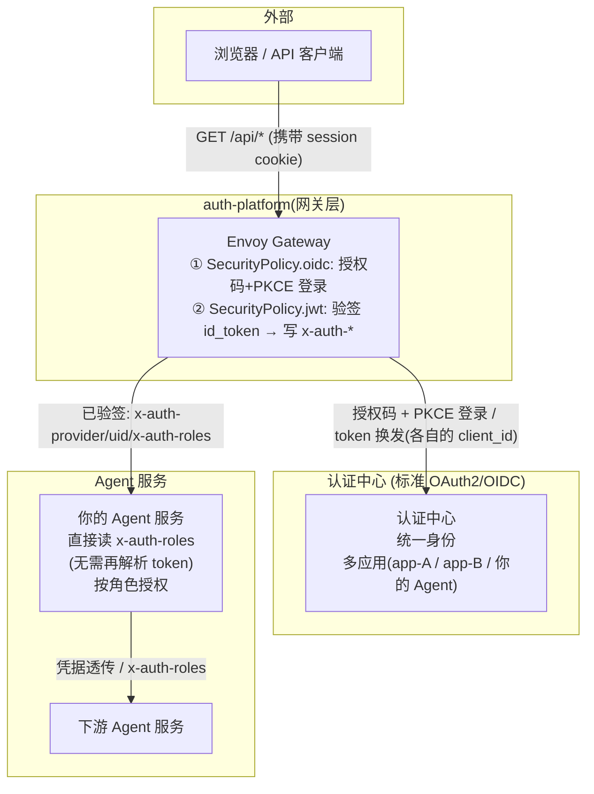

# auth-platform 技术文档 —— Agent 开发接入指南

> 适用对象：所有需要接入统一登录鉴权的 Agent 服务开发者。
> 一句话结论：**你的 Agent 服务不需要自己对接登录，也不需要自己写权限校验。Envoy Gateway 用
> 原生 `SecurityPolicy`（oidc + jwt）完成登录与验签，并把「用户身份 + 角色」以 `x-auth-*`
> 请求头带给你；你只需读取 `x-auth-roles` 拿到当前用户角色，按角色拦截请求、控制权限。**

---

## 1. 背景

### 1.1 为什么要做 auth-platform

Agent 服务越来越多，每个服务都需要"用户登录 + 权限校验"。如果每个服务都自己对接认证中心，会有三个问题：

1. **重复造轮子**：授权码登录、token 管理、会话、登出这些逻辑在每个服务都要实现一遍；
2. **接入面不同**：同一认证中心下，不同 Agent 以**不同应用（client_id）**接入，各自要处理登录、取角色；
3. **接入成本重复摊派**：20 多个 Agent 各自写一遍 OAuth 客户端流程依旧是重复劳动。

**因此 build 了 auth-platform**：把「对接认证中心、提取角色」这件事收敛到 **Envoy Gateway 层**统一完成。
认证中心是**标准 OAuth2/OIDC**，网关用 `SecurityPolicy` 处理登录与验签，Agent 只需读网关注入的
`x-auth-roles` 做权限控制。

### 1.2 目标

- 基于标准 OAuth2 授权码（+PKCE）实现统一登录/登出；
- **单一认证中心**承载全部用户，不同应用（Agent）以各自 `client_id` 接入，按应用隔离身份与角色；
- 向 Agent 服务提供当前用户的**角色**，用于权限控制（**只返回 role**）；
- Agent 服务之间调用可透传凭证，无需再次认证。

### 1.3 前置条件（硬要求）

- 认证中心为**标准 OAuth2/OIDC**（一套，承载全部用户与多个应用）；
- 认证中心签发的 `id_token` 中**原生带 `roles`**，且各应用 `roles` 命名一致（本方案不做角色字段归一化）。

> **为什么校验 `id_token` 而不是 `access_token`？** Logto 默认签发的 `access_token` 是 **opaque**（非 JWT），
> 即便指定 `resource` 参数可签发 JWT 形态的 access_token，其中也**不含 `roles` claim**（`roles` 只在 `id_token`）。
> 因此 `SecurityPolicy.jwt` 从 `IdToken-<app>` cookie 取出 `id_token` 验签并提取 `roles`。

---

## 2. 总体架构与技术方案

### 2.1 架构图



### 2.2 组件职责

| 组件 | 职责 | 你（Agent 开发者）需要关心吗 |
|------|------|:---:|
| **认证中心（标准 OAuth2/OIDC）** | **单一**中心，统一身份 + 承载多个应用（client）；`roles` 在 `id_token` 中 | 否 |
| **Envoy Gateway** | 唯一入口。每 APP 一条 `HTTPRoute` + `SecurityPolicy`（oidc 登录 + jwt 验签 + 注入 `x-auth-*`） | 否 |
| **你的 Agent 服务** | 读取 `x-auth-provider/uid/x-auth-roles`，按 `roles` 控制权限 | ✅ 需要接入 |

### 2.3 核心设计决策

- **D1 声明式网关**：登录用 `SecurityPolicy.oidc`（授权码 + PKCE），验签用 `SecurityPolicy.jwt`（`localJWKS`），
  按 Host 用 `HTTPRoute` 分流，**无需自研 Adapter、无需自维护 Envoy 配置**。
- **D2 只返回角色**：`x-auth-roles` 为唯一授权依据（`roles` 数组，Envoy 会 base64 编码）。
- **D3 多 Agent 隔离**：每 APP 一份 `SecurityPolicy`（各自 `clientID` / `clientSecret` / `redirectURL` / `audiences`），
  按 Host 分流、各走各的 SSO。
- **D4 强制经网关**：Agent 只开 ClusterIP，外部唯一入口是网关。

---

## 3. 网关注入的请求头（Agent 唯一要关心的）

| 请求头 | 内容 | 示例 |
|--------|------|------|
| `x-auth-provider` | 应用标识（`aud` claim） | `agent1` / `agent2` |
| `x-auth-uid` | 用户 ID（`sub` claim） | `qxtag12knnup` |
| `x-auth-roles` | 角色（`roles` 数组，**base64 编码**） | `WyJqb2ItbWFuYWdlciJd` → `["job-manager"]` |
| `x-auth-custom-data` | 用户自定义数据整体（对象型 claim，**base64 编码的 JSON**） | base64 解码 → `{"department":"R&D","level":"L5",...}` |

> 读取 `x-auth-roles` 时**先 base64 解码再 JSON 解析**；`x-auth-custom-data` 同理，解码即得完整
> `custom_data`（参考 `deploy/echo-server/main.go`）。
> 如需 `x-auth-username`，在网关 `claimToHeaders` 追加 `claim: preferred_username` 即可。

---

## 4. 核心调用链

### 4.1 未登录（登录触发）

```
浏览器访问 /api/*（无会话 cookie）
  → SecurityPolicy.oidc: 302 → 认证中心 /authorize?response_type=code&client_id&redirect_uri&scope&state&code_challenge
  → 用户在认证中心登录
  → 认证中心 302 回跳 {redirectURL}?code=xxx&state=xxx
  → 数据面校验 state → code+code_verifier → /token 换 token → 发会话 cookie（IdToken-<app>）
  → 302 回原 URL
```

### 4.2 已登录访问（核心调用链）

```
浏览器 GET /api/hello（带会话 cookie）
  → SecurityPolicy.jwt: 用 localJWKS 公钥验签 id_token → 提取 roles
  → 写 x-auth-provider/uid/x-auth-roles 头
  → HTTPRoute 分流 → 转发到你的 Agent 服务
  → 你的服务: 读取 x-auth-roles → 按角色拦截 → 返回结果
```

### 4.3 Agent 间调用

下游直接透传 `x-auth-roles`（连同 `x-auth-provider`），下游经网关验签或自行判断：

```go
req.Header.Set("x-auth-roles", incomingReq.Header.Get("x-auth-roles"))
```

---

## 5. Agent 服务接入步骤

| 步骤 | 操作 | 你是否要做 |
|------|------|:---:|
| 1 | 在认证中心注册应用，拿到 `client_id`/`client_secret`，确认 `roles` 声明存在 | 视情况 |
| 2 | 在网关加该 APP 的 `HTTPRoute` + `SecurityPolicy`（oidc + jwt），配回调域名 | 平台侧 |
| 3 | 部署业务服务为 ClusterIP | ✅ 你 |
| 4 | 你的服务读取 `x-auth-provider/uid/x-auth-roles` | ✅ 你 |
| 5 | 写权限拦截逻辑：按应用(`provider`)隔离、按 `roles` 授权 | ✅ 你 |

---

## 6. 安全注意事项（务必看）

1. **必须验签**：`SecurityPolicy.jwt` 用 `localJWKS` 验签 `id_token`，校验 `iss`/`aud`/`exp`；`x-auth-*` 头只由网关注入；
2. **信任边界**：只要 Agent 只被网关访问，即可信任 `x-auth-roles`；若可能被绕过直连，请再对 `Authorization` token 本地验签；
3. **角色一致性**：各应用的 `roles` 命名必须统一（在认证中心侧保证）；
4. **client_secret 管理**：通过 K8s Secret 注入；登录启用 PKCE；
5. **权限最小化**：按 `roles` 最小授权，并做应用(`provider`)隔离；日志不打印 token；
6. **TLS（重要）**：会话 cookie（含 `IdToken-<app>`）带 `secure` 属性，**必须走 HTTPS**，
   否则浏览器不会回传这些 cookie、无法保持登录态。访问 `https://agent*.example.com`；证书为内网自签，
   需先信任 `certs/ca.crt`。

---

## 7. 部署形态

- 认证中心为 **Logto**（`logto.auth-platform.svc.cluster.local:3001`，自签 TLS），应用
  `agent1` / `agent2`（Traditional）。
- **网关入口**：`https://agent2.example.com` / `https://agent1.example.com`（DNS → 网关 IP `172.31.9.53`）。
- **测试账号**：`alice` / `bob`，密码 `Test@123456`（角色 `job-manager`），用于验证登录与授权。
- 一次性/共享清单（namespace / Logto / Gateway / GatewayClass / CA 信任 / 通配证书）在
  `deploy/base/`；每个 Agent 一套（HTTPRoute / SecurityPolicy / OIDC secret / 后端服务）在
  `deploy/agents/<agent>/`；模板在 `deploy/agents/_template/`。

---

## 8. 相关文档

- [Envoy Gateway 方案（权威）`../deploy/README.md`](../deploy/README.md)
- [架构文档 `architecture.md`](architecture.md)、[详细设计 `detailed-architecture.md`](detailed-architecture.md)
- [整套方案验证指南 `verification-guide.md`](verification-guide.md)
- [接入指南 `integration-guide.md`](integration-guide.md)、[安全设计 `security.md`](security.md)
- 示例业务服务：`deploy/echo-server/main.go`

> 已按 **`id_token` 验签（SecurityPolicy.jwt）** 端到端验证：未登录 `/` → 302 到 Logto（client_id 各自隔离）；
> 登录后返回 `{"user":{"username":"alice","uid":"...","provider":"agent1","roles":["job-manager"]}}`。
